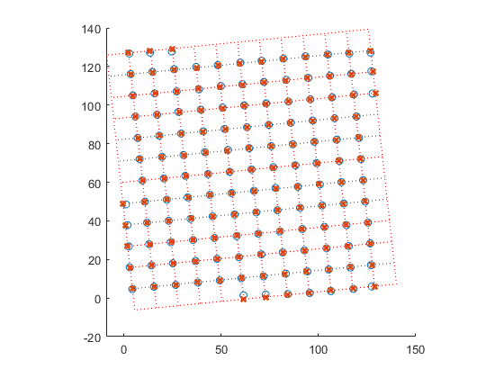
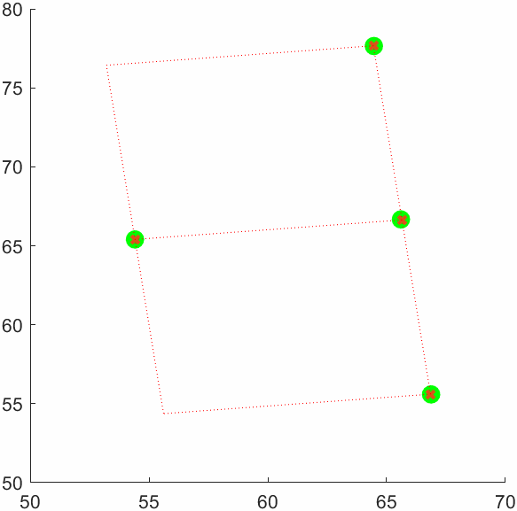

# Noisy Lattice Denoising

This repository implements an algorithm to recover the underlying lattice structure from noisy 2D measurements. Given a set of points perturbed by Gaussian noise, the code estimates the lattice origin and basis vectors that minimize the overall mean squared error (MSE) and outputs the integer lattice coordinates for each point.

See the image below for an example. The circles are the given noisy measurements, which we are given initially.
We then compute the minimum square error lattice, plotted with dotted lines in the figure. The crosses are where the adjusted measurements fall in the lattice.



An iterative procedure is used to obtain the solution, seen in the animation below.



## Features

* Automatic initialization of lattice origin and basis
* Iterative coordinate assignment and basis refinement
* Visualization of noisy measurements, recovered lattice points, and lattice grid lines
* Support for both batch processing and incremental (online) fitting

## Requirements

* MATLAB R2018b or later
* Optimization Toolbox (for `fminsearch`)
* Statistics and Machine Learning Toolbox (for `pdist` and `squareform`)

## Repository Structure

```
/denoiseLattice.m             Main function for batch lattice denoising
/legacy_matlab/               Legacy scripts for baseline implementations
    noisyLattice.m            Simple batch version with heuristic initialization
    noisyLatticeIncremental.m Incremental version processing points one by one
/README.md                    Project documentation
/example.png                  Sample noisy measurements visualization
/animated.gif                 Iterative lattice fitting animation
```

## Installation

1. Clone the repository:

   ```bash
   git clone https://github.com/yourusername/Noisy-lattice-problem.git
   ```
2. Add the project folder to your MATLAB path:

   ```matlab
   addpath('path/to/Noisy-lattice-problem');
   ```
3. Open MATLAB and navigate to the project directory.

## Usage

### Batch Mode

```matlab
% Assume noisyMes is a 2×N matrix of noisy 2D points:
[coords, origin, v1, v2] = denoiseLattice(noisyMes);
% coords: 2×N integer coordinates in lattice space
% origin: 2×1 vector representing the lattice origin
% v1, v2: 2×1 basis vectors defining the lattice
```

### Incremental Mode

```matlab
% Legacy script with point-by-point fitting:
legacy_matlab/noisyLatticeIncremental.m
% Adjust parameters (e.g., data source, number of iterations) and run.
noisyLatticeIncremental
```

## Algorithm Overview

1. **Initialization**: Select an initial origin as the point with the smallest sum of distances to all other points. Initialize basis vectors using the nearest neighbor and its perpendicular.
2. **Coordinate Assignment**: For each measurement, compute floating-point lattice coordinates by solving:

   $$
     \lambda = [v_1\; v_2]^{-1}(p - origin),
   $$

   then round within a small search window to find the nearest integer lattice coordinates.
3. **Basis Refinement**: Optimize the origin and basis vectors by minimizing total squared reconstruction error:

   $$
     \min_{origin, v_1, v_2} \sum_k \|origin + \lambda_k^1 v_1 + \lambda_k^2 v_2 - p_k\|^2
   $$

   using MATLAB's `fminsearch`.
4. **Iteration**: Alternate between coordinate assignment and basis refinement until convergence or maximum iterations.


## Contributing

Contributions are welcome! Please fork the repository, create a feature branch, and open a pull request for review.

## License

This project is licensed under the MIT License. See [LICENSE](LICENSE) for details.

## Citation

If you use this code in your research or projects, please cite:

> T. Ortega, “Noisy Lattice Denoising,” GitHub repository, 2025. Available at [https://github.com/TomasOrtega/Noisy-lattice-problem](https://github.com/TomasOrtega/Noisy-lattice-problem)
