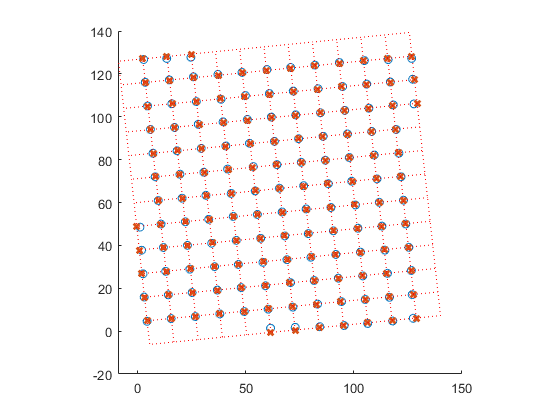
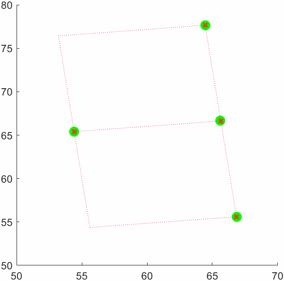

# Noisy Lattice Denoising

This repository implements an algorithm to recover the underlying lattice structure from noisy 2D measurements. Given a set of points perturbed by Gaussian noise, the code estimates the lattice origin and basis vectors that minimize the overall mean squared error (MSE) and outputs the integer lattice coordinates for each point.

See the image below for an example. The circles are the original noisy measurements.
The dotted lines show the lattice that minimizes the mean squared reconstruction error,
and the crosses show the corresponding denoised lattice points.



An iterative procedure is used to obtain the solution, seen in the animation below.



## Features

* Automatic initialization of lattice origin and basis
* Iterative coordinate assignment and basis refinement
* Visualization of noisy measurements, recovered lattice points, and lattice grid lines
* Support for both batch processing and incremental (online) fitting
* Available in both Python and MATLAB implementations
* Comprehensive test suite for Python implementation

## Requirements

### Python Version
* Python 3.6 or later
* NumPy >= 1.19.0
* SciPy >= 1.7.0
* Matplotlib >= 3.3.0

Create a virtual environment and install the dependencies with
[uv](https://docs.astral.sh/uv/):

```bash
uv venv
uv pip install -r requirements.txt
```

### MATLAB Version
* MATLAB R2018b or later
* Optimization Toolbox (for `fminsearch`)
* Statistics and Machine Learning Toolbox (for `pdist` and `squareform`)

## Repository Structure

```
/denoise_lattice.py          Main Python function for batch lattice denoising
/test_denoise_lattice.py     Python test suite
/requirements.txt            Python package dependencies
/denoiseLattice.m            Main MATLAB function for batch lattice denoising
/legacy_matlab/              Legacy MATLAB scripts for baseline implementations
    noisyLattice.m           Simple batch version with heuristic initialization
    noisyLatticeIncremental.m Incremental version processing points one by one
/README.md                   Project documentation
/example.png                 Sample noisy measurements visualization
/animated.gif                Iterative lattice fitting animation
```

## Usage

### Python Version

```python
import numpy as np
from denoise_lattice import denoise_lattice

# Generate or load your noisy measurements
# noisy_mes should be a 2×N numpy array of noisy 2D points
[coords, origin, v1, v2] = denoise_lattice(noisy_mes)

# coords: 2×N integer coordinates in lattice space
# origin: 2×1 vector representing the lattice origin
# v1, v2: 2×1 basis vectors defining the lattice
```

The Python implementation includes an example usage in the main block that generates random noisy lattice points and demonstrates the algorithm.

### MATLAB Version

```matlab
% Assume noisyMes is a 2×N matrix of noisy 2D points:
[coords, origin, v1, v2] = denoiseLattice(noisyMes);
% coords: 2×N integer coordinates in lattice space
% origin: 2×1 vector representing the lattice origin
% v1, v2: 2×1 basis vectors defining the lattice
```

### Incremental Mode (MATLAB only)

```matlab
% Legacy script with point-by-point fitting:
legacy_matlab/noisyLatticeIncremental.m
% Adjust parameters (e.g., data source, number of iterations) and run.
noisyLatticeIncremental
```

## Algorithm Overview

### 1. Initialization

Select an initial origin as the point with the smallest sum of distances to all
other points. Initialize the first basis vector using its nearest neighbor and
the second as the perpendicular vector.

### 2. Coordinate Assignment

Form the basis matrix

$$
V = \begin{bmatrix} \mathbf{v}_1 & \mathbf{v}_2 \end{bmatrix}.
$$

For each measurement $\mathbf{p}_k$, compute its floating-point lattice
coordinates:

$$
\widetilde{\boldsymbol{\lambda}}_k
= V^{-1}\left(\mathbf{p}_k - \mathbf{o}\right).
$$

Search a small window around the rounded result to select the nearest integer
coordinates $\boldsymbol{\lambda}_k \in \mathbb{Z}^2$.

### 3. Basis Refinement

Optimize the origin $\mathbf{o}$ and basis vectors $\mathbf{v}_1, \mathbf{v}_2$
by minimizing the total squared reconstruction error:

$$
\min_{\mathbf{o}, \mathbf{v}_1, \mathbf{v}_2}
\sum_{k=1}^{n}
\left\lVert
\mathbf{o} +
\lambda_{k,1}\mathbf{v}_1 +
\lambda_{k,2}\mathbf{v}_2 -
\mathbf{p}_k
\right\rVert_2^2.
$$

The implementation solves this problem with `fminsearch` in MATLAB and
`scipy.optimize.fmin` in Python.

### 4. Iteration

Alternate between coordinate assignment and basis refinement until convergence
or the maximum number of iterations is reached.


## License

This project is licensed under the GNU General Public License v3.0. See
[LICENSE](LICENSE) for details.

## Citation

If you use this software, please cite it using the metadata in
[CITATION.cff](CITATION.cff).

Project website:
[https://tomasortega.net/Noisy-lattice-problem/](https://tomasortega.net/Noisy-lattice-problem/)
